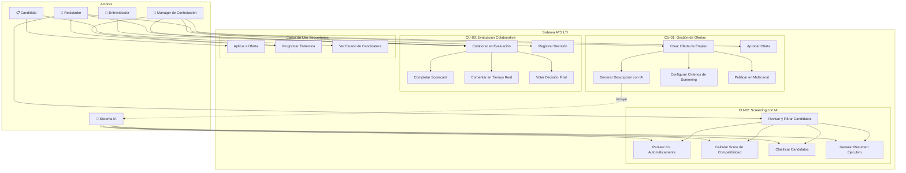
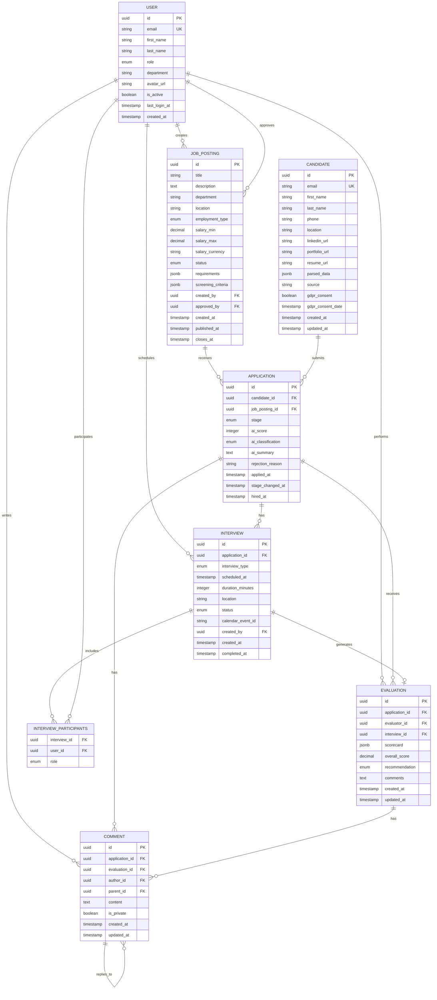
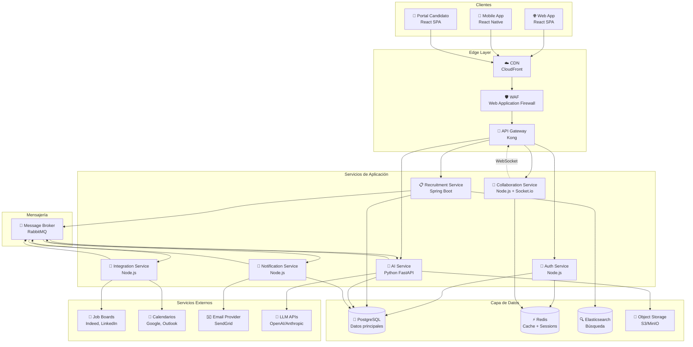
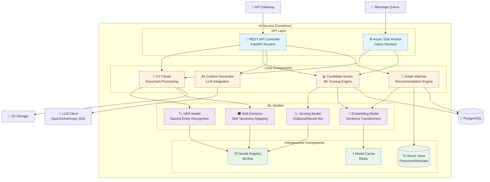

# 🚀 LTI ATS - Applicant Tracking System del Futuro

## Informe de Diseño y Documentación del Sistema

**Versión:** 1.0 (MVP)  
**Fecha:** Noviembre 2025  
**Elaborado por:** Equipo Multidisciplinar LTI

---

# I. Visión de Producto y Estrategia

## 1. Definición del Software LTI

### Descripción

**LTI ATS** es un Sistema de Seguimiento de Candidatos (Applicant Tracking System) de nueva generación diseñado para transformar la manera en que los departamentos de Recursos Humanos gestionan sus procesos de reclutamiento. La plataforma integra **inteligencia artificial avanzada**, **colaboración en tiempo real** y **automatización inteligente** para ofrecer una experiencia de contratación más eficiente, precisa y humana.

### Valor Añadido para Clientes (Departamentos de HR)

| Área | Valor Añadido |
|------|---------------|
| **Eficiencia Operativa** | Reducción del 60% en tiempo de screening mediante IA que analiza y rankea candidatos automáticamente |
| **Calidad de Contratación** | Matching inteligente que incrementa la compatibilidad candidato-puesto en un 40% |
| **Colaboración** | Evaluación en tiempo real con múltiples stakeholders, eliminando silos de información |
| **Experiencia del Candidato** | Portal personalizado con seguimiento transparente del proceso, mejorando el employer branding |
| **Cumplimiento Legal** | Gestión automática de GDPR y normativas laborales locales |
| **Insights Accionables** | Dashboards con métricas predictivas para optimizar la estrategia de talento |

### Ventajas Competitivas Clave

1. **IA Conversacional Integrada (LTI Copilot):** Asistente inteligente que ayuda a redactar ofertas, sugiere preguntas de entrevista personalizadas y genera resúmenes ejecutivos de candidatos.

2. **Scoring Predictivo de Éxito:** Algoritmo propietario que predice la probabilidad de éxito y retención del candidato basándose en datos históricos y patrones de la organización.

3. **Colaboración Sincrónica:** Evaluaciones en tiempo real con comentarios instantáneos, votaciones y decisiones colaborativas sin necesidad de reuniones adicionales.

4. **Automatización de Workflows Inteligente:** Motor de reglas que adapta automáticamente el proceso de selección según el tipo de puesto, urgencia y volumen de candidatos.

5. **Integración Nativa con Ecosistema HR:** Conectores pre-construidos con HRIS, calendarios, herramientas de videollamada y sistemas de evaluación de skills.

6. **Multiposting Inteligente:** Publicación automática en múltiples job boards con optimización SEO y A/B testing de descripciones.

---

## 2. Funcionalidades Principales (MVP Priorizado)

Las funcionalidades están ordenadas de **mayor a menor prioridad** para la implementación del MVP:

### Prioridad Crítica (Must Have)

| # | Funcionalidad | Descripción |
|---|---------------|-------------|
| 1 | **Gestión de Ofertas de Empleo** | Crear, editar, duplicar y archivar ofertas con plantillas personalizables |
| 2 | **Publicación Multicanal** | Publicar ofertas en job boards, web corporativa y redes sociales desde un único punto |
| 3 | **Recepción y Parsing de CVs** | Importación automática de candidaturas con extracción inteligente de datos del CV |
| 4 | **Pipeline de Candidatos** | Vista Kanban del proceso con etapas configurables y movimiento drag-and-drop |
| 5 | **Screening con IA** | Filtrado y ranking automático de candidatos basado en requisitos del puesto |
| 6 | **Perfiles de Candidato** | Ficha completa con historial, documentos, evaluaciones y timeline de interacciones |
| 7 | **Comunicación con Candidatos** | Emails automatizados y personalizados en cada etapa del proceso |
| 8 | **Programación de Entrevistas** | Integración con calendarios para scheduling automático con disponibilidad compartida |

### Prioridad Alta (Should Have)

| # | Funcionalidad | Descripción |
|---|---------------|-------------|
| 9 | **Colaboración en Evaluación** | Scorecards compartidos, comentarios en tiempo real y sistema de votación |
| 10 | **LTI Copilot (IA Asistente)** | Generación de descripciones de puesto, sugerencias de preguntas y resúmenes |
| 11 | **Tests y Evaluaciones Online** | Módulo integrado para pruebas técnicas, psicométricas y de competencias |
| 12 | **Dashboard y Reporting** | Métricas clave: time-to-hire, source effectiveness, pipeline conversion |
| 13 | **Gestión de Ofertas Laborales** | Generación y envío de cartas de oferta con firma electrónica |

### Prioridad Media (Could Have)

| # | Funcionalidad | Descripción |
|---|---------------|-------------|
| 14 | **Talent Pool** | Base de datos de candidatos pasivos para futuras oportunidades |
| 15 | **Portal del Candidato** | Área privada donde el candidato ve su estado y actualiza información |
| 16 | **Scoring Predictivo** | Predicción de éxito y retención basada en ML |
| 17 | **Integraciones Avanzadas** | API abierta y conectores con HRIS, Slack, Teams |

### Prioridad Baja (Won't Have - v1)

| # | Funcionalidad | Descripción |
|---|---------------|-------------|
| 18 | **Video Entrevistas Nativas** | Módulo de entrevistas pregrabadas y en vivo |
| 19 | **Onboarding Module** | Gestión del proceso de incorporación |
| 20 | **Referral Management** | Programa de referencias de empleados |

---

## 3. Modelo de Negocio (Lean Canvas)

| **Problema** | **Solución** | **Propuesta de Valor Única** |
|--------------|--------------|------------------------------|
| 1. Procesos de selección lentos y manuales | Automatización inteligente del screening y comunicación | **"El ATS que piensa contigo"** - IA integrada que reduce el time-to-hire un 50% mientras mejora la calidad de contratación |
| 2. Dificultad para evaluar candidatos colaborativamente | Herramientas de colaboración en tiempo real | |
| 3. Falta de insights accionables sobre el proceso | Dashboard predictivo con métricas avanzadas | |

| **Ventaja Injusta** | **Segmentos de Cliente** |
|---------------------|--------------------------|
| Algoritmo propietario de matching y scoring predictivo entrenado con datos de +10M contrataciones | **Primario:** Empresas medianas (50-500 empleados) con equipos HR de 2-10 personas |
| Equipo fundador con experiencia en IA aplicada a HR | **Secundario:** Scale-ups tecnológicas con alto volumen de contratación |
| | **Terciario:** Consultoras de selección boutique |

| **Métricas Clave** | **Canales** |
|--------------------|-------------|
| - MRR (Monthly Recurring Revenue) | - Marketing de contenidos (blog, webinars) |
| - CAC (Customer Acquisition Cost) | - SEO/SEM y presencia en comparadores |
| - Churn Rate mensual | - Partnership con consultoras HR |
| - NPS de usuarios | - Freemium con upgrade path |
| - Time-to-value (días hasta primera contratación) | - Eventos HR y conferencias |

| **Estructura de Costes** | **Fuentes de Ingresos** |
|--------------------------|-------------------------|
| - Infraestructura cloud (AWS/GCP) | **Suscripción SaaS tiered:** |
| - Desarrollo y producto (equipo core) | - Starter: €199/mes (hasta 10 jobs activos) |
| - Costes de IA (APIs, training) | - Professional: €499/mes (ilimitado + IA básica) |
| - Marketing y ventas | - Enterprise: €999+/mes (IA avanzada + integraciones) |
| - Soporte al cliente | **Add-ons:** Multiposting premium, assessments, API calls |

---

# II. Análisis de Requisitos y Casos de Uso

## 1. Casos de Uso Esenciales

### CU-01: Crear y Publicar Oferta de Empleo

**Actores:** Reclutador, Manager de Contratación

**Descripción:** Permite crear una nueva oferta de empleo con asistencia de IA y publicarla en múltiples canales simultáneamente.

**Precondiciones:**
- El usuario está autenticado en el sistema
- El usuario tiene permisos de creación de ofertas
- Existe al menos un canal de publicación configurado

**Flujo Principal:**

1. El Reclutador accede al módulo de ofertas y selecciona "Nueva Oferta"
2. El sistema muestra el formulario con campos: título, departamento, ubicación, tipo de contrato, rango salarial
3. El Reclutador completa los campos básicos
4. El sistema activa LTI Copilot que sugiere una descripción optimizada basada en el título y datos de la empresa
5. El Reclutador revisa y edita la descripción generada
6. El Reclutador define los requisitos obligatorios y deseables (skills, experiencia, formación)
7. El sistema genera automáticamente los criterios de screening para la IA
8. El Reclutador selecciona los canales de publicación (job boards, web, redes sociales)
9. El Manager de Contratación es notificado para aprobar la oferta
10. El Manager revisa y aprueba la oferta
11. El sistema publica automáticamente en los canales seleccionados
12. El sistema confirma la publicación y muestra los enlaces activos

**Flujos Alternativos:**

- **4a.** El Reclutador prefiere escribir manualmente: omite la sugerencia de IA
- **10a.** El Manager solicita cambios: la oferta vuelve al Reclutador para edición
- **11a.** Error en publicación: el sistema notifica y permite reintento manual

**Postcondiciones:**
- La oferta está activa y visible en los canales seleccionados
- El pipeline de candidatos está inicializado
- Se registra el tracking de fuentes para analytics

---

### CU-02: Revisar y Filtrar Candidatos con IA

**Actores:** Reclutador, Sistema de IA

**Descripción:** El sistema procesa automáticamente las candidaturas recibidas, extrae información de los CVs y genera un ranking basado en la compatibilidad con los requisitos del puesto.

**Precondiciones:**
- Existe una oferta activa con candidaturas recibidas
- Los criterios de screening están configurados para la oferta
- El módulo de IA está operativo

**Flujo Principal:**

1. El Sistema de IA detecta nuevas candidaturas en la cola de procesamiento
2. El sistema extrae datos estructurados del CV (parsing): experiencia, formación, skills, idiomas
3. El sistema compara los datos extraídos con los requisitos de la oferta
4. El sistema calcula un score de compatibilidad (0-100) para cada candidato
5. El sistema clasifica candidatos en categorías: "Muy compatible", "Compatible", "Revisar", "No apto"
6. El sistema genera un resumen ejecutivo de cada candidato destacando fortalezas y gaps
7. El Reclutador accede al pipeline y ve los candidatos ordenados por score
8. El Reclutador revisa los candidatos "Muy compatibles" primero
9. El Reclutador puede ajustar la clasificación manual si discrepa con la IA
10. El Reclutador mueve los candidatos seleccionados a la siguiente etapa
11. El sistema envía automáticamente emails de estado a los candidatos descartados

**Flujos Alternativos:**

- **2a.** CV no parseable (imagen, formato corrupto): el sistema marca para revisión manual
- **4a.** Empate en scores: el sistema aplica criterios secundarios (fecha de aplicación, fuente)
- **9a.** El Reclutador solicita más información: el sistema consulta fuentes adicionales (LinkedIn)

**Postcondiciones:**
- Todos los candidatos están clasificados y rankeados
- Los candidatos descartados han sido notificados
- Las métricas de screening se actualizan en el dashboard

---

### CU-03: Colaborar en la Evaluación de un Candidato

**Actores:** Reclutador, Manager de Contratación, Entrevistador (Hiring Team)

**Descripción:** Múltiples miembros del equipo de contratación evalúan colaborativamente a un candidato mediante scorecards compartidos, comentarios en tiempo real y sistema de votación para tomar una decisión consensuada.

**Precondiciones:**
- El candidato ha pasado la fase de screening
- Está programada al menos una entrevista
- El equipo de evaluación está definido para la oferta

**Flujo Principal:**

1. El Entrevistador completa una entrevista con el candidato
2. El Entrevistador accede al perfil del candidato en el sistema
3. El sistema muestra el scorecard configurado para esa etapa (competencias a evaluar)
4. El Entrevistador puntúa cada competencia (1-5) y añade comentarios justificativos
5. El Entrevistador indica su recomendación global: "Avanzar", "Dudoso", "Rechazar"
6. El sistema notifica en tiempo real al resto del equipo que hay una nueva evaluación
7. El Manager de Contratación accede y ve todas las evaluaciones agregadas
8. El Manager puede añadir comentarios o preguntas sobre evaluaciones específicas
9. Los evaluadores responden y debaten en el hilo de comentarios
10. El sistema calcula automáticamente el score promedio y muestra el consenso visual
11. El Manager inicia una votación para la decisión final
12. Todos los evaluadores votan: "Sí", "No", "Necesita más entrevistas"
13. El sistema muestra el resultado de la votación
14. El Manager toma la decisión final y la registra
15. El sistema mueve al candidato a la etapa correspondiente y actualiza su estado

**Flujos Alternativos:**

- **5a.** El Entrevistador no pudo evaluar todas las competencias: marca parcial y justifica
- **11a.** No hay consenso: el Manager programa una reunión de calibración
- **12a.** Un evaluador no está disponible: el sistema permite votar asincrónicamente con deadline

**Postcondiciones:**
- El candidato tiene una evaluación completa y documentada
- La decisión está registrada con audit trail
- El candidato avanza, es rechazado o se programa más entrevistas

---

## 2. Diagrama de Casos de Uso

**Formato: Mermaid**

---

# III. Modelo de Datos

## 1. Entidades, Atributos y Relaciones

### Entidad: **JobPosting** (Oferta de Empleo)

| Atributo | Tipo | Descripción |
|----------|------|-------------|
| `id` | UUID | Identificador único |
| `title` | String(200) | Título del puesto |
| `description` | Text | Descripción completa (HTML/Markdown) |
| `department` | String(100) | Departamento |
| `location` | String(150) | Ubicación (puede ser "Remote") |
| `employment_type` | Enum | FULL_TIME, PART_TIME, CONTRACT, INTERNSHIP |
| `salary_min` | Decimal | Rango salarial mínimo |
| `salary_max` | Decimal | Rango salarial máximo |
| `salary_currency` | String(3) | Código ISO de moneda |
| `status` | Enum | DRAFT, PENDING_APPROVAL, ACTIVE, PAUSED, CLOSED |
| `requirements` | JSONB | Requisitos estructurados (skills, experiencia, formación) |
| `screening_criteria` | JSONB | Criterios para IA scoring |
| `created_by` | UUID (FK) | Usuario que creó la oferta |
| `approved_by` | UUID (FK) | Manager que aprobó |
| `created_at` | Timestamp | Fecha de creación |
| `published_at` | Timestamp | Fecha de publicación |
| `closes_at` | Timestamp | Fecha de cierre |

---

### Entidad: **Candidate** (Candidato)

| Atributo | Tipo | Descripción |
|----------|------|-------------|
| `id` | UUID | Identificador único |
| `email` | String(255) | Email (único) |
| `first_name` | String(100) | Nombre |
| `last_name` | String(100) | Apellidos |
| `phone` | String(20) | Teléfono |
| `location` | String(150) | Ubicación actual |
| `linkedin_url` | String(500) | Perfil de LinkedIn |
| `portfolio_url` | String(500) | Portfolio/Web personal |
| `resume_url` | String(500) | URL del CV almacenado |
| `parsed_data` | JSONB | Datos extraídos del CV (skills, experiencia, educación) |
| `source` | String(100) | Fuente de origen (LinkedIn, Indeed, Referral, etc.) |
| `gdpr_consent` | Boolean | Consentimiento GDPR |
| `gdpr_consent_date` | Timestamp | Fecha del consentimiento |
| `created_at` | Timestamp | Fecha de registro |
| `updated_at` | Timestamp | Última actualización |

---

### Entidad: **Application** (Candidatura)

| Atributo | Tipo | Descripción |
|----------|------|-------------|
| `id` | UUID | Identificador único |
| `candidate_id` | UUID (FK) | Referencia al candidato |
| `job_posting_id` | UUID (FK) | Referencia a la oferta |
| `stage` | Enum | NEW, SCREENING, INTERVIEW, ASSESSMENT, OFFER, HIRED, REJECTED |
| `ai_score` | Integer | Score de compatibilidad IA (0-100) |
| `ai_classification` | Enum | HIGHLY_COMPATIBLE, COMPATIBLE, REVIEW, NOT_SUITABLE |
| `ai_summary` | Text | Resumen generado por IA |
| `rejection_reason` | String(500) | Motivo de rechazo (si aplica) |
| `applied_at` | Timestamp | Fecha de candidatura |
| `stage_changed_at` | Timestamp | Última actualización de etapa |
| `hired_at` | Timestamp | Fecha de contratación (si aplica) |

---

### Entidad: **Evaluation** (Evaluación)

| Atributo | Tipo | Descripción |
|----------|------|-------------|
| `id` | UUID | Identificador único |
| `application_id` | UUID (FK) | Referencia a la candidatura |
| `evaluator_id` | UUID (FK) | Usuario que evalúa |
| `interview_id` | UUID (FK) | Entrevista asociada (opcional) |
| `scorecard` | JSONB | Puntuaciones por competencia |
| `overall_score` | Decimal | Puntuación media calculada |
| `recommendation` | Enum | ADVANCE, UNCERTAIN, REJECT |
| `comments` | Text | Comentarios generales |
| `created_at` | Timestamp | Fecha de evaluación |
| `updated_at` | Timestamp | Última modificación |

---

### Entidad: **Interview** (Entrevista)

| Atributo | Tipo | Descripción |
|----------|------|-------------|
| `id` | UUID | Identificador único |
| `application_id` | UUID (FK) | Referencia a la candidatura |
| `interview_type` | Enum | PHONE_SCREEN, VIDEO, ONSITE, TECHNICAL, FINAL |
| `scheduled_at` | Timestamp | Fecha y hora programada |
| `duration_minutes` | Integer | Duración estimada |
| `location` | String(300) | Ubicación o enlace de videollamada |
| `status` | Enum | SCHEDULED, COMPLETED, CANCELLED, NO_SHOW |
| `calendar_event_id` | String(200) | ID del evento en calendario externo |
| `created_by` | UUID (FK) | Usuario que programó |
| `created_at` | Timestamp | Fecha de creación |
| `completed_at` | Timestamp | Fecha de finalización |

---

### Entidad: **User** (Usuario del Sistema)

| Atributo | Tipo | Descripción |
|----------|------|-------------|
| `id` | UUID | Identificador único |
| `email` | String(255) | Email corporativo (único) |
| `first_name` | String(100) | Nombre |
| `last_name` | String(100) | Apellidos |
| `role` | Enum | ADMIN, RECRUITER, HIRING_MANAGER, INTERVIEWER, VIEWER |
| `department` | String(100) | Departamento |
| `avatar_url` | String(500) | URL de foto de perfil |
| `is_active` | Boolean | Estado activo/inactivo |
| `last_login_at` | Timestamp | Último acceso |
| `created_at` | Timestamp | Fecha de creación |

---

### Entidad: **Comment** (Comentario Colaborativo)

| Atributo | Tipo | Descripción |
|----------|------|-------------|
| `id` | UUID | Identificador único |
| `application_id` | UUID (FK) | Referencia a la candidatura |
| `evaluation_id` | UUID (FK) | Evaluación asociada (opcional) |
| `author_id` | UUID (FK) | Usuario que comenta |
| `parent_id` | UUID (FK) | Comentario padre (para hilos) |
| `content` | Text | Contenido del comentario |
| `is_private` | Boolean | Solo visible para el equipo de HR |
| `created_at` | Timestamp | Fecha de creación |
| `updated_at` | Timestamp | Última edición |

---

### Relaciones entre Entidades

| Relación | Tipo | Descripción |
|----------|------|-------------|
| JobPosting → Application | 1:N | Una oferta tiene muchas candidaturas |
| Candidate → Application | 1:N | Un candidato puede aplicar a múltiples ofertas |
| Application → Evaluation | 1:N | Una candidatura tiene múltiples evaluaciones |
| Application → Interview | 1:N | Una candidatura tiene múltiples entrevistas |
| Application → Comment | 1:N | Una candidatura tiene múltiples comentarios |
| User → Evaluation | 1:N | Un usuario puede hacer múltiples evaluaciones |
| User → Comment | 1:N | Un usuario puede hacer múltiples comentarios |
| User → JobPosting (created_by) | 1:N | Un usuario crea múltiples ofertas |
| User → Interview (interviewers) | N:M | Múltiples entrevistadores en una entrevista |
| Interview → Evaluation | 1:1 | Cada entrevista puede tener una evaluación asociada |
| Comment → Comment (parent) | 1:N | Comentarios pueden tener respuestas (hilos) |

---

## 2. Diagrama de Relación de Entidades (ERD)

**Formato: Mermaid**

---

# IV. Diseño de Arquitectura (Alto Nivel)

## 1. Diseño del Sistema Explicado

La arquitectura de LTI ATS sigue un patrón de **microservicios** desplegado en la nube, diseñado para escalabilidad, resiliencia y desarrollo independiente de componentes.

### Componentes Principales

#### 1. **Frontend SPA (Single Page Application)**
- **Tecnología:** React + TypeScript
- **Responsabilidad:** Interfaz de usuario para reclutadores, managers y candidatos
- **Características:** Actualizaciones en tiempo real vía WebSocket, PWA para móvil

#### 2. **API Gateway**
- **Tecnología:** Kong / AWS API Gateway
- **Responsabilidad:** Punto de entrada único, autenticación JWT, rate limiting, routing
- **Características:** SSL termination, request validation, logging centralizado

#### 3. **Servicio de Autenticación (Auth Service)**
- **Tecnología:** Node.js + Passport.js
- **Responsabilidad:** Gestión de usuarios, SSO, OAuth2, tokens JWT
- **Características:** Integración con proveedores externos (Google, Microsoft, SAML)

#### 4. **Servicio de Reclutamiento (Recruitment Service)**
- **Tecnología:** Java Spring Boot
- **Responsabilidad:** Core del negocio - ofertas, candidaturas, pipeline, workflows
- **Base de datos:** PostgreSQL (datos relacionales principales)

#### 5. **Servicio de IA (AI Service)**
- **Tecnología:** Python FastAPI + ML models
- **Responsabilidad:** Parsing de CVs, scoring, generación de contenido, matching
- **Características:** Modelos propios + integración con LLMs externos (OpenAI/Anthropic)

#### 6. **Servicio de Comunicaciones (Notification Service)**
- **Tecnología:** Node.js
- **Responsabilidad:** Emails transaccionales, notificaciones push, SMS
- **Integraciones:** SendGrid, Twilio, Firebase Cloud Messaging

#### 7. **Servicio de Colaboración (Collaboration Service)**
- **Tecnología:** Node.js + Socket.io
- **Responsabilidad:** Comentarios en tiempo real, presencia de usuarios, votaciones
- **Base de datos:** Redis (caché y pub/sub)

#### 8. **Servicio de Integraciones (Integration Service)**
- **Tecnología:** Node.js
- **Responsabilidad:** Conectores con job boards, calendarios, HRIS, LinkedIn
- **Características:** Queue-based processing, retry logic, webhooks

#### 9. **Almacenamiento de Archivos (File Storage)**
- **Tecnología:** AWS S3 / MinIO
- **Responsabilidad:** CVs, documentos, fotos de perfil
- **Características:** CDN para distribución, virus scanning

#### 10. **Message Broker**
- **Tecnología:** RabbitMQ / Apache Kafka
- **Responsabilidad:** Comunicación asíncrona entre servicios, event sourcing
- **Características:** Dead letter queues, guaranteed delivery

### Comunicación entre Componentes

| Patrón | Uso | Descripción |
|--------|-----|-------------|
| **REST API** | Síncrona | Operaciones CRUD estándar entre servicios |
| **WebSocket** | Tiempo real | Actualizaciones de UI, colaboración, notificaciones |
| **Event-driven** | Asíncrona | Procesamiento de CVs, envío de emails, integraciones |
| **gRPC** | Alta performance | Comunicación interna entre microservicios críticos |

---

## 2. Diagrama de Componentes de Alto Nivel

**Formato: Mermaid**

---

## 3. Diagrama C4 - Nivel 3: AI Service (Componentes Internos)

Se profundiza en el **AI Service**, componente clave para la diferenciación de LTI ATS.

### Descripción del AI Service

El AI Service es responsable de todas las capacidades de inteligencia artificial del sistema:

- **CV Parsing:** Extracción estructurada de datos de currículums
- **Candidate Scoring:** Cálculo de compatibilidad candidato-puesto
- **Content Generation:** Generación de descripciones, preguntas, resúmenes
- **Smart Matching:** Recomendación de candidatos para ofertas y viceversa

**Formato: Mermaid**

### Descripción de Componentes del AI Service

| Componente | Responsabilidad | Tecnología |
|------------|-----------------|------------|
| **REST API Controller** | Expone endpoints síncronos para operaciones de IA | FastAPI |
| **Async Task Worker** | Procesa tareas pesadas de forma asíncrona | Celery + Redis |
| **CV Parser** | Extrae datos estructurados de CVs en múltiples formatos | Apache Tika + custom NLP |
| **Candidate Scorer** | Calcula score de compatibilidad candidato-puesto | Scikit-learn + XGBoost |
| **Content Generator** | Genera descripciones, preguntas y resúmenes | LangChain + OpenAI/Claude API |
| **Smart Matcher** | Recomienda candidatos y ofertas mediante embeddings | Sentence Transformers + FAISS |
| **NER Model** | Extrae entidades nombradas (empresas, títulos, fechas) | SpaCy custom model |
| **Skill Extractor** | Mapea texto a taxonomía estándar de skills | Fine-tuned BERT |
| **Scoring Model** | Modelo predictivo de éxito del candidato | XGBoost entrenado con datos históricos |
| **Embedding Model** | Genera representaciones vectoriales de texto | all-MiniLM-L6-v2 |
| **Vector Store** | Almacena embeddings para búsqueda semántica | Pinecone / Weaviate |
| **Model Registry** | Versiona y gestiona modelos de ML | MLflow |

---

# Anexo: Resumen Ejecutivo

## Visión del MVP

LTI ATS v1.0 es un sistema de seguimiento de candidatos que combina la robustez de un ATS tradicional con capacidades de IA de nueva generación. El MVP se centra en tres pilares:

1. **Automatización Inteligente:** Reducir el trabajo manual en screening y comunicación
2. **Colaboración Sin Fricciones:** Evaluación en tiempo real con todo el equipo de contratación
3. **Insights Accionables:** Dashboards que ayudan a optimizar el proceso de selección

## Métricas de Éxito del MVP

| Métrica | Objetivo |
|---------|----------|
| Time-to-hire promedio | Reducción del 40% vs baseline del cliente |
| Candidatos screeneados por recruiter/día | Incremento del 3x |
| Satisfacción del usuario (NPS) | ≥ 50 |
| Tasa de adopción de IA features | ≥ 70% de usuarios activos |
| Time-to-value | ≤ 7 días hasta primera contratación |

## Roadmap Post-MVP

| Fase | Timeline | Features |
|------|----------|----------|
| v1.1 | +3 meses | Video entrevistas nativas, Talent Pool avanzado |
| v1.2 | +6 meses | Scoring predictivo de retención, Marketplace de assessments |
| v2.0 | +12 meses | Onboarding module, Analytics predictivo, Mobile app nativa |

---

*Documento generado por el equipo multidisciplinar de LTI*  
*Versión: 1.0 | Noviembre 2025*
