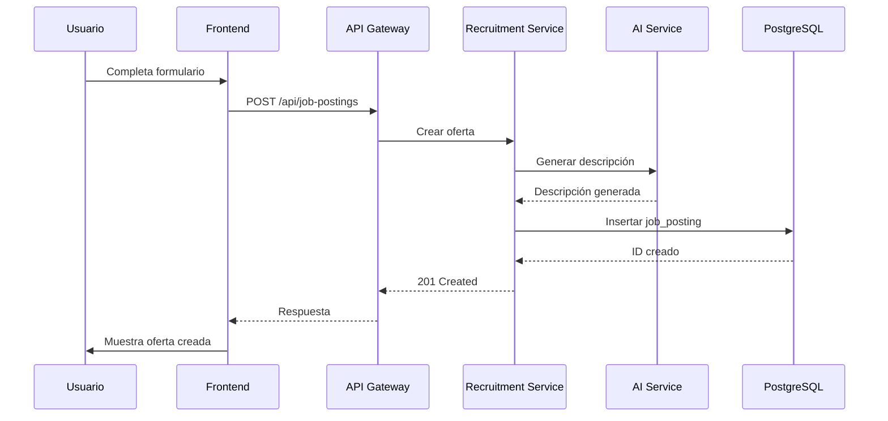

# PROMPT EFC-0
Tengo esta información de las historias de usuario que pongo adjunta. (La información copiada del master).
Tengo un PRD completo del sistema LTI ATS en LTI-EFC.md y necesitas crear prompts estructurados para generar User Stories, Backlog, Tickets y Estimaciones. Voy a actualizar el archivo prompts.md con todos los prompts necesarios usando la metodología memory-bank.

Tengo que hacer este ejercicio, puedes ayudarme a preparar los promtps necesarios para que ejecute todo. Creame un fichero denominado prompt.md donde se añadan todos los prompts que hemos generado, incluido este. Y además, utilizando la metodología de memori-bank, explica el contexto que queremos hacer, y prepararme los prompts que necesito para hacer el ejercicio que describo a continuación.

En este ejercicio vas a actuar como un Product Manager y Business Analyst. 
Usando los documentos que generaste en la sección anterior y que conforman un PRD básico (funcionalidades clave, casos de uso, modelo de datos...), tu misión es preparar la documentación necesaria para empezar a implementar LTI:
1. Generar las User Stories. Puedes implementar tantas como quieras y puedas, el mínimo son 2. Utiliza lo aprendido sobre buenas prácticas de este capítulo para que contenga toda la información necesaria, y como consejo, usa una plantilla común para todas ellas (recuerda que dejamos un ejemplo de plantilla en la sección de User Stories).
2. Arma el Backlog de producto con las User Stories, priorizándolas como consideres conveniente acorde a alguna metodología concreta. experimenta con diferentes formas de generar un prompt que te pueda genera tu back log basado en la documentación que has generado previamente. Entrega los diferentes prompts que usaste e indica cual prompt te dio mejores resultados. Entrega junto a los prompts tus conclusiones, por qué crees este prompt fue efectivo. 
3. Elige la User Story que prefieras, y genera los Tickets de trabajo. Aterrízalos técnicamente, tal y como se hace en las reuniones de planificación
4. (Extra 🎁) Estima el esfuerzo de los tickets de trabajo usando la metodología (fibonacci, poker, tallas de camiseta) y unidades (horas, puntos de historia) que prefieras.

1. Visión general de la gestión de producto
En el contexto de las metodologías ágiles, hay varios elementos a distintos niveles de abstracción que trabajan en conjunto para facilitar la planificación y ejecución efectiva de productos y proyectos. 

Product Roadmap
Es un plan estratégico de alto nivel que define la visión y dirección del producto a lo largo del tiempo. El roadmap comunica los objetivos y las prioridades a largo plazo, y está diseñado para guiar la toma de decisiones estratégicas en relación con el desarrollo del producto.

Épica
Una épica es una gran agrupación de trabajo que se puede desglosar en historias de usuario más pequeñas. Las épicas son componentes clave del roadmap y representan iniciativas o características importantes que se desarrollarán.

Historia de Usuario
Las historias de usuario son descripciones cortas y simples de una característica desde la perspectiva del usuario final. Estas historias ayudan a que el equipo entienda lo que necesita el usuario y por qué. Las historias de usuario son desgloses de las épicas y se diseñan para ser entregadas en uno o varios sprints.

Ticket de Trabajo
Los tickets o tareas son aún más específicos que las historias de usuario y a menudo representan acciones concretas que se deben realizar para completar una historia de usuario. Estos pueden incluir bugs a corregir, mejoras, o tareas específicas de desarrollo y pruebas.


2. Introducción a las Historias de Usuario
Vamos a centrarnos ahora en el componente esencial de los flujos de trabajo en equipos de software ágiles: las historias de usuario. 

Ya se ha comentado que describen una características desde la perspectiva del valor aportado al usuario final. Sin embargo, a menudo se genera confusión entre las historias de usuario, los casos de uso y los tickets de trabajo. Los 3 nos ayudan a identificar ls funcionalidades que vamos a desarrollar, así como los requisitos, tanto funcionales como no funcionales, pero desde diferentes ópticas. ¿Cómo se relacionan, y en qué se diferencian?

User Stories: Estas historias describen una función del software desde la perspectiva del usuario final. A menudo se redactan en la forma "Como [rol de usuario], quiero [objetivo] para que pueda [beneficio]". Las User Stories pueden derivarse directamente de las funcionalidades o casos de uso identificadas en la fase de análisis, y deben centrarse en satisfacer una necesidad del usuario final.
Use Cases: Los Use Cases son descripciones más detalladas de cómo un sistema debe comportarse y se utilizan para capturar las interacciones de usuario y sistema. A menudo proporcionan un paso a paso de cómo un usuario interactúa con una funcionalidad para lograr un resultado y pueden incluir flujos de trabajo alternativos o "caminos felices" y "no tan felices". Los casos de uso pueden ser útiles para describir tanto requisitos funcionales como no funcionales. Más información y ejemplos en el módulo anterior
Tickets de trabajo (a veces llamados "issues" o "historias" en JIRA y otras plataformas): Estos son los elementos de trabajo individuales que los desarrolladores deben completar. Estos tickets pueden representar User Stories o Use Cases, o pueden representar tareas técnicas específicas necesarias para implementar una funcionalidad (feature). Una feature puede desglosarse en varios tickets dependiendo de su complejidad.
Así que, para resumir:

En el análisis de requisitos y casos de uso se define la visión y los objetivos del producto, y se identifican las features necesarias para cumplirlo. 
Las features podrían ser un User Story o un conjunto de User Stories que, una vez implementadas, cumplen con un Requisito Funcional. 
Cada User Story puede a su vez desglosarse en Tickets de trabajo que son las tareas específicas que los desarrolladores deben llevar a cabo para implementar la feature. En estos tickets de trabajo se deben cubrir requisitos tanto funcionales como no funcionales (tales como tiempos de respuesta, seguridad, escalabilidad, mantenibilidad...).
Características de las User Stories
Las User Stories describen una característica del software desde la perspectiva del usuario final. 

Las características más importantes que deben cumplir las User Stories para cumplir su cometido son:

Descripción informal y en lenguaje natural: Las User Stories describen las características del software de una manera sencilla y no técnica, desde el punto de vista del usuario. Es importante el storytelling, no es una descripción técnica, y si se puede vincular al avatar / buyer persona / usuario que lo demanda, mejor.
Enfocadas en el usuario: Las User Stories se enfocan en lo que el usuario quiere lograr, en lugar de en las funcionalidades técnicas del sistema.
Estructura clásica: Generalmente siguen el formato: "Como un [tipo de usuario], quiero [realizar una acción] para [obtener un beneficio]".
Priorización y estimación: Las User Stories se priorizan, y se les asigna un esfuerzo estimado por parte del equipo de desarrollo en caso de que sea una de las variables a tener en cuenta en la priorización.
Conversación y confirmación: Las User Stories fomentan la conversación entre los responsables de producto, los stakeholders y el equipo técnico, y se confirman una vez que la funcionalidad se ha implementado.
Evolución iterativa: A medida que el proyecto avanza, las User Stories pueden evolucionar y cambiar para adaptarse a las necesidades cambiantes.


Pero quién escribe las User Stories?
En el contexto de metodologías ágiles como Scrum, cualquiera puede escribir User Stories. Es responsabilidad del Product Owner asegurarse de que exista un Product Backlog actualizado y priorizado de User Stories, pero eso no significa que el Product Owner sea el único que las escribe. Los propietarios de productos, las partes interesadas, los gerentes de productos y otros miembros del equipo de negocios participan en la redacción de User Stories. Se recomienda que la redacción de User Stories sea un esfuerzo colaborativo de todo el equipo ágil, lo que incluye al Product Owner, Business Analyst, desarrolladores, testers y cualquier otro rol relevante en el equipo.

Las User Stories son una herramienta central para debatir y validar las necesidades de los usuarios y trabajar en su implementación. Proporcionan un lenguaje universal que los miembros del equipo, las partes interesadas y los clientes entienden y hablan, lo que facilita la colaboración y el entendimiento mutuo.

En la práctica, esto significa que las User Stories se utilizan para desarrollar una comprensión del producto deseado por el usuario y para guiar el desarrollo del software de manera incremental y centrada en el valor

Como crear buenas user stories
Enfocarse en el usuario:
Las user stories deben estar escritas desde la perspectiva del usuario final, no desde la perspectiva interna de la organización.
Utilizar personajes o "personas" para entender mejor las necesidades y objetivos de los usuarios.
Mantener un formato simple y conciso:
Seguir el formato estándar: "Como [tipo de usuario], quiero [realizar una acción] para [obtener un beneficio]".
Evitar detalles técnicos o instrucciones de implementación.
Mantener las historias lo suficientemente pequeñas y entregables en un sprint.
Priorizar y estimar:
Priorizar las historias de usuario en función de su valor para el negocio y el usuario.
Estimar el esfuerzo requerido para implementar cada historia.
Fomentar la colaboración:
Escribir las historias de usuario de manera colaborativa con el equipo de desarrollo.
Usar las historias de usuario como punto de partida para conversaciones más profundas.
Incluir criterios de aceptación:
Definir claramente los criterios que deben cumplirse para considerar una historia "terminada".
Evitar centrarse en cómo se construirá la funcionalidad.
Mantener las historias actualizadas:
Estar preparado para evolucionar y refinar las historias a medida que el proyecto avanza.
Utilizar técnicas como el User Story Mapping para organizar y priorizar las historias.
Siguiendo estos pasos, se pueden crear user stories efectivas que mantengan el enfoque en las necesidades de los usuarios, faciliten la colaboración del equipo y guíen el desarrollo del producto de manera ágil y centrada en el valor.


Estructura basica de una User Story
Formato estándar: "Como [tipo de usuario], quiero [realizar una acción] para [obtener un beneficio]".
Descripción: Una descripción concisa y en lenguaje natural de la funcionalidad que el usuario desea.
Criterios de Aceptación: Condiciones específicas que deben cumplirse para considerar la User Story como "terminada", éstos deberian de seguir un formato similar a “Dado que” [contexto inicial], "cuando” [acción realizada], “entonces” [resultado esperado].
Notas adicionales:  Notas que puedan ayudar al desarrollo de la historia
Tareas: Lista de tareas y subtareas para que esta historia pueda ser completada

Ejemplos de User Story
Desarrollo de Productos:"Como gerente de producto, quiero una manera en que los miembros del equipo puedan entender cómo las tareas individuales contribuyen a los objetivos, para que puedan priorizar mejor su trabajo."
Experiencia del Cliente:"Como cliente recurrente, espero que mi información quede guardada para crear una experiencia de pago más fluida, para que pueda completar mis compras de manera rápida y sencilla."
Aplicación Móvil:"Como usuario frecuente de la aplicación, quiero una forma de simplificar la información relevante de la manera más rápida posible, para poder acceder a la información que necesito de manera eficiente."
Estos ejemplos muestran cómo las User Stories se enfocan en las necesidades y objetivos de los usuarios finales, en lugar de en las funcionalidades técnicas. La estructura simple y el lenguaje natural ayudan a que todos los miembros del equipo, incluyendo stakeholders no técnicos, puedan entender y colaborar en el desarrollo del producto.


Ejemplo completo:

Tal y como se mostró en el primer tema, una estructura clásica de User Story podría ser:

Título de la Historia de Usuario: 

Como [rol del usuario],
quiero [acción que desea realizar el usuario],
para que [beneficio que espera obtener el usuario].
Criterios de Aceptación:

[Detalle específico de funcionalidad]
[Detalle específico de funcionalidad]
[Detalle específico de funcionalidad]
Notas Adicionales:

[Cualquier consideración adicional]
Historias de Usuario Relacionadas:

[Relaciones con otras historias de usuario]
 


Como la AI puede ayudarnos a crear nuestras User Stories
La inteligencia artificial puede ser de gran ayuda en el proceso de identificación, creación, evaluación, revisión y priorización de User Stories de las siguientes formas:

Identificación: La IA puede analizar el PRD y otras fuentes de datos para identificar automáticamente las necesidades y requerimientos de los usuarios que luego se pueden convertir en User Stories.
Creación: Utilizando técnicas de generación de lenguaje natural, la IA puede ayudar a redactar nuevas User Stories basadas en las necesidades del usuario y los requisitos del producto.
Evaluación: La IA puede utilizar algoritmos de aprendizaje automático para evaluar y validar las User Stories, identificando posibles inconsistencias, lagunas o conflictos en los requisitos.
Revisión: La IA puede ayudar en la revisión de las User Stories, proporcionando recomendaciones para mejorar la claridad, coherencia y completitud de las historias.
Priorización: Basándose en ciertos criterios predefinidos, la IA puede ayudar a priorizar las User Stories en función de su valor para el usuario, complejidad, dependencias y otros factores relevantes.
Al aprovechar la inteligencia artificial en el proceso de creación y gestión de User Stories, los equipos de desarrollo pueden optimizar su tiempo y recursos, garantizando que las historias estén bien definidas, alineadas con las necesidades del usuario y priorizadas de manera efectiva para el éxito del producto.

Prompt para detectar posibles problemas y sugerir mejoras:

Analiza las funcionalidades existentes del sistema de alquiler de bicicletas para identificar los cinco problemas más comunes que los usuarios podrían enfrentar y sugerir mejoras

Respuesta 🤖

Análisis de Problemas Comunes:

Disponibilidad limitada en horas pico: Sugerir un sistema dinámico de precios o reservas anticipadas para mejorar la disponibilidad.
Mantenimiento de bicicletas: Implementar un sistema automatizado para reportar y rastrear problemas de mantenimiento, basado en el feedback del usuario y sensores IoT.
Dificultad en la localización de estaciones: Mejorar la interfaz de usuario con mapas más claros y opciones de realidad aumentada para encontrar estaciones cercanas fácilmente.
Integración con otros medios de transporte: Proporcionar una opción en la app para integrar la planificación de rutas que incluya otros modos de transporte público.
Soporte al cliente deficiente: Establecer un sistema de atención al cliente más reactivo y accesible mediante chatbots de IA y líneas directas de soporte.


2. Priorización del Backlog de Producto
Para priorizar eficazmente el backlog de un proyecto de desarrollo de software, especialmente en un contexto Agile, se deben considerar múltiples factores que afectan tanto la entrega del proyecto como la satisfacción del usuario final. Aquí se detallan los elementos y consideraciones esenciales para una priorización efectiva:

Factores para la Priorización del Backlog
Valor del Negocio: Identificar las user stories y mejoras que aportan el mayor valor al negocio o a los usuarios finales. Esto incluye impacto en la retención de usuarios, atractivo para nuevos usuarios y potencial de ingresos.
Urgencia: Determinar qué características son más urgentes en términos de necesidades del mercado o compromisos con los stakeholders.
Dependencias: Reconocer y priorizar tareas que otras tareas dependen para su implementación. Esto asegura un flujo de trabajo lógico y eficiente.
Coste de implementación: Considerar el esfuerzo, los recursos y el tiempo necesarios para cada tarea. Priorizar aquellas con la mejor relación costo-beneficio.
Riesgos y obstáculos potenciales: Evaluar los riesgos asociados con cada user story o mejora y su impacto potencial en el proyecto.
Feedback del usuario: Integrar las opiniones y preferencias de los usuarios, especialmente en áreas críticas de la interfaz de usuario y la experiencia del usuario.
Madurez tecnológica: Considerar la madurez y la viabilidad de las soluciones tecnológicas propuestas para cada tarea.
Proceso de priorización
Revisión de Stakeholders: Involucrar a los stakeholders clave en el proceso de priorización para asegurar que el backlog refleje los objetivos del negocio.
Sesiones de Priorización con el Equipo: Utilizar técnicas como Planning Poker o la matriz de Eisenhower para consensuar la importancia de cada tarea.
Iteración y Reevaluación: El backlog debe ser dinámico, reevaluando y ajustando las prioridades regularmente a medida que avanza el proyecto y surgen nuevos datos.
Dado que la priorización es una tarea tan crítica en el devenir de un proyecto de software, y cada vez se tiene más en cuenta la opinión de los programadores, te recomiendo ver los recursos adicionales sobre este tema al final del módulo.


Ejemplo: Uso de IA para priorizar el Backlog
Siguiendo con el servicio de reserva de bicicletas, a continuación te mostramos un ejemplo de cómo usar las historias de usuario creadas para convertirlo en un backlog priorizado:

Prompt:

Considera el backlog de producto creado anteriormente para el sistema de reserva de bicicletas:

User Stories

User Story 1: Turista Explorador. Como un turista que visita la ciudad por primera vez, quiero reservar una bicicleta fácilmente desde mi smartphone para explorar los lugares turísticos recomendados.
User Story 2: Residente Local. Como un residente que usa la bicicleta diariamente, quiero poder programar reservas recurrentes para asegurar mi transporte a la hora de ir al trabajo.
[...]

Estima por cada item en el backlog (genera una tabla markdown):

Impacto en el usuario y valor del negocio.
Urgencia basada en tendencias del mercado y feedback de usuarios.
Complejidad y esfuerzo estimado de implementación.
Riesgos y dependencias entre tareas.
Respuesta 🤖

Para evaluar y priorizar el backlog utilizando un algoritmo de aprendizaje automático, primero es esencial definir los criterios de evaluación y luego asignar una puntuación a cada ítem del backlog. Las siguientes categorías pueden ser consideradas para cada ítem:

Criterios de Priorización:

Impacto en el usuario y valor del negocio
Urgencia basada en tendencias del mercado y feedback de usuarios
Complejidad y esfuerzo estimado de implementación
Riesgos y dependencias entre tareas
Estimación de Priorización:


Explicación de la Tabla:

User Stories: Las historias enfocadas en el turista y el residente local tienen alto impacto y urgencia media a alta debido a su potencial para mejorar significativamente la experiencia del usuario y fidelizar clientes.
Optimización de Rutas y Recomendaciones con IA: Este ítem tiene un alto impacto y es urgente, pero también es complejo y podría presentar más riesgos debido a la necesidad de tecnología avanzada y integración con sistemas existentes.
Problemas y Mejoras: Los problemas como la disponibilidad en horas pico y el mantenimiento de bicicletas tienen un alto impacto, pues afectan directamente la satisfacción y retención del usuario.
Esta tabla es una representación simplificada y debería ser ajustada con datos más específicos y análisis detallado para una priorización precisa en un contexto real. 


Conclusión
El backlog en Agile es una herramienta vital que evoluciona con el proyecto, garantizando que el equipo se mantenga enfocado y alineado con las necesidades del usuario. 

Se ha compartido un ejemplo para mostrar cómo la integración de IA en esta fase no solo aumenta la eficiencia sino que también mejora la calidad y relevancia de los elementos que se incluyen, permitiendo una gestión más dinámica y adaptativa del desarrollo del producto.

Como siempre, la calidad del contexto introducido es clave para obtener respuestas de calidad. Y como siempre, aunque esto puede ser una muy buena semilla que agilice la creación de artefactos y documentación, debemos revisar de manera concienzuda la respuesta para retocar, ampliar o corregir aquello que, según nuestro criterio y nuestra experiencia como ingenieros/as, consideremos.

# PROMPT EFC-1
Ejecutar los siguientes pasos documentando todo en el fichero UserStories-EFC difiniendo claramente donde está cada punto, y la opinión sobre la tabla comparativa.

Para tu ejercicio, sigue este orden:
PROMPT INICIAL → 1.1 → 2.1 (experimenta con 2.2, 2.3, 2.4) → 3.1 → 4.1 + 4.3
Para el punto 2 del ejercicio (experimentar con diferentes prompts de backlog):
Ejecuta los 4 prompts de la Parte 2 (2.1, 2.2, 2.3, 2.4)
Compara los resultados
Usa la tabla comparativa incluida para analizar ventajas/desventajas
Documenta cuál te dio mejores resultados y por qué
Recomendación para LTI ATS:
User Stories: Prompt 1.1 (completo de una vez)
Backlog: Prompt 2.1 (MoSCoW) - más rápido y alineado con tu PRD
Tickets: Prompt 3.1 (descomposición técnica)
Estimación: Prompt 4.1 (Planning Poker) + 4.3 (riesgos para tickets complejos)


# Prompts para Generación de User Stories y Backlog - LTI ATS

## Contexto del Proyecto (Memory Bank)

### Información del Sistema
**Proyecto:** LTI ATS (Applicant Tracking System)
**Descripción:** Sistema de seguimiento de candidatos de nueva generación que integra IA avanzada, colaboración en tiempo real y automatización inteligente para transformar los procesos de reclutamiento.

### Documentación Base Disponible
- **PRD Completo:** Documento LTI-EFC.md que contiene:
  - Visión de producto y estrategia
  - 20 funcionalidades priorizadas (MVP hasta Won't Have v1)
  - 3 casos de uso esenciales detallados (CU-01, CU-02, CU-03)
  - Modelo de datos completo (7 entidades principales)
  - Arquitectura de microservicios con 10 componentes
  - Diagramas de casos de uso y ERD

### Actores Principales del Sistema
- **Reclutador:** Gestiona ofertas y procesos de selección
- **Manager de Contratación:** Aprueba ofertas y toma decisiones finales
- **Entrevistador/Hiring Team:** Evalúa candidatos
- **Candidato:** Aplica a ofertas y consulta su estado
- **Sistema de IA:** Procesa CVs, rankea candidatos, genera contenido

### Funcionalidades Prioritarias (Must Have - MVP)
1. Gestión de Ofertas de Empleo
2. Publicación Multicanal
3. Recepción y Parsing de CVs con IA
4. Pipeline de Candidatos (Kanban)
5. Screening con IA
6. Perfiles de Candidato
7. Comunicación automatizada con Candidatos
8. Programación de Entrevistas
9. Colaboración en Evaluación
10. Dashboard y Reporting

---

## PROMPT INICIAL (Contexto para la IA)

```
# Contexto del Proyecto LTI ATS

Eres un Product Manager y Business Analyst senior especializado en sistemas de Recursos Humanos y metodologías ágiles.

Estás trabajando en LTI ATS, un sistema de seguimiento de candidatos (Applicant Tracking System) de nueva generación que integra:
- **Inteligencia Artificial** para screening automático y scoring de candidatos
- **Colaboración en tiempo real** para evaluaciones en equipo
- **Automatización inteligente** de comunicaciones y workflows

## Información Clave del Proyecto

### Usuarios Objetivo
- Empresas medianas (50-500 empleados) con equipos HR de 2-10 personas
- Scale-ups tecnológicas con alto volumen de contratación

### Valor Diferencial
- Reducción del 60% en tiempo de screening mediante IA
- Matching inteligente que mejora compatibilidad en 40%
- LTI Copilot: asistente IA conversacional integrado
- Colaboración sincrónica sin reuniones adicionales

### Stack Tecnológico
- **Frontend:** React + TypeScript
- **Backend:** Microservicios (Java Spring Boot, Node.js, Python FastAPI)
- **Datos:** PostgreSQL, Redis, Elasticsearch
- **IA:** ML models propios + integración con LLMs (OpenAI/Anthropic)

### Casos de Uso Esenciales Documentados
1. **CU-01:** Crear y Publicar Oferta de Empleo (con asistencia de IA)
2. **CU-02:** Revisar y Filtrar Candidatos con IA (parsing + scoring)
3. **CU-03:** Colaborar en la Evaluación de un Candidato (scorecards + votación)

### Modelo de Datos Principal
- **JobPosting** (ofertas de empleo)
- **Candidate** (candidatos)
- **Application** (candidaturas con scoring IA)
- **Interview** (entrevistas programadas)
- **Evaluation** (evaluaciones con scorecards)
- **User** (usuarios del sistema: recruiters, managers, interviewers)
- **Comment** (comentarios colaborativos en tiempo real)

**Documento PRD Completo:** Disponible en LTI-EFC.md con 930 líneas de especificaciones detalladas.

Tu misión es generar documentación ágil de calidad para iniciar la implementación del MVP.
```

---

# PARTE 1: Generación de User Stories

## PROMPT 1.1 - Generar User Stories (Enfoque Completo)

```
Basándote en el PRD de LTI ATS (documento LTI-EFC.md) y los 3 casos de uso esenciales documentados, genera un conjunto completo de User Stories para el MVP siguiendo estas instrucciones:

## Estructura Requerida para Cada User Story

Título de la Historia de Usuario: [Nombre descriptivo y conciso]

**Como** [rol del usuario],
**quiero** [acción que desea realizar el usuario],
**para que** [beneficio que espera obtener el usuario].

**Criterios de Aceptación:**
- Dado que [contexto inicial],
  cuando [acción realizada],
  entonces [resultado esperado].
- [Repetir para cada escenario relevante]

**Notas Adicionales:**
- [Consideraciones técnicas, restricciones, integraciones necesarias]

**Tareas Técnicas:**
- [ ] Tarea 1
- [ ] Tarea 2
- [ ] Tarea 3

**Historias de Usuario Relacionadas:**
- [Referencias a otras US dependientes o relacionadas]

---

## Requisitos Específicos

1. **Cobertura:** Genera al menos 8-10 User Stories que cubran:
   - Gestión de ofertas de empleo (creación, edición, publicación)
   - Recepción y screening de candidatos con IA
   - Evaluación colaborativa de candidatos
   - Comunicación automatizada
   - Dashboard de métricas

2. **Priorización:** Enfócate en funcionalidades **Must Have** y **Should Have** del PRD.

3. **Actores:** Incluye User Stories para:
   - Reclutador
   - Manager de Contratación
   - Entrevistador
   - Candidato (al menos 1)

4. **Nivel de Detalle:**
   - Criterios de aceptación específicos y medibles
   - Al menos 3-5 criterios por User Story
   - Tareas técnicas realistas (frontend, backend, IA, integraciones)

5. **Formato:** Usa markdown con emojis para roles (📋 Reclutador, 👔 Manager, 🎤 Entrevistador, 👤 Candidato).

## Ejemplo de Referencia

**US-001: Crear Oferta de Empleo con Asistencia de IA**

**Como** 📋 Reclutador,
**quiero** crear una nueva oferta de empleo con sugerencias automáticas de IA para la descripción,
**para que** pueda publicar ofertas optimizadas en menos tiempo.

**Criterios de Aceptación:**
- Dado que soy un Reclutador autenticado,
  cuando accedo a "Nueva Oferta" e ingreso título, departamento y ubicación,
  entonces el sistema activa LTI Copilot y me sugiere una descripción optimizada en menos de 5 segundos.

- Dado que reviso la descripción generada por IA,
  cuando edito o acepto la sugerencia y completo requisitos obligatorios,
  entonces puedo guardar la oferta como borrador o enviarla a aprobación.

- Dado que selecciono canales de publicación,
  cuando el Manager aprueba la oferta,
  entonces el sistema publica automáticamente en todos los canales y me muestra los enlaces activos.

**Notas Adicionales:**
- Integración con OpenAI/Anthropic para generación de descripciones
- Soporte para plantillas personalizables por departamento
- Notificación en tiempo real al Manager para aprobación

**Tareas Técnicas:**
- [ ] Diseñar formulario de creación en React con validaciones
- [ ] Crear endpoint POST /api/job-postings en Recruitment Service
- [ ] Integrar llamada a LTI Copilot (AI Service) para generación de descripción
- [ ] Implementar workflow de aprobación con notificaciones
- [ ] Desarrollar publicación multicanal (Integration Service)

**Historias de Usuario Relacionadas:**
- US-002: Publicar Oferta en Job Boards
- US-009: Recibir Notificación de Oferta Pendiente de Aprobación

---

Genera ahora las User Stories siguiendo esta estructura y requisitos.
```

---

## PROMPT 1.2 - Generar User Stories (Enfoque Iterativo por Actor)

```
Vamos a generar User Stories para LTI ATS de forma iterativa, actor por actor. Empecemos con el **Reclutador**.

Basándote en el PRD (LTI-EFC.md) y las funcionalidades Must Have del MVP, genera 4-5 User Stories para el **Reclutador** que cubran:

1. Creación y publicación de ofertas de empleo
2. Revisión de candidatos con asistencia de IA
3. Gestión del pipeline de candidatos
4. Programación de entrevistas

Usa la estructura estándar:
- Título descriptivo
- Como [rol] quiero [acción] para que [beneficio]
- Criterios de Aceptación en formato Dado-Cuando-Entonces (mínimo 3 por US)
- Notas Adicionales (técnicas)
- Tareas Técnicas (4-6 por US)
- Historias Relacionadas

Recuerda incluir consideraciones de UX, integraciones con IA, y notificaciones en tiempo real donde aplique.

---

**[Después de recibir la respuesta de la IA, continuar con:]**

Perfecto. Ahora genera 3-4 User Stories para el **Manager de Contratación** que incluyan:
1. Aprobación de ofertas de empleo
2. Revisión de evaluaciones de candidatos
3. Toma de decisiones colaborativas (votaciones)
4. Visualización de métricas del proceso

---

**[Después de recibir la respuesta, continuar con:]**

Excelente. Genera 2-3 User Stories para el **Entrevistador/Hiring Team**:
1. Completar evaluación post-entrevista con scorecard
2. Colaborar con comentarios en tiempo real
3. Votar sobre candidatos

---

**[Finalmente:]**

Por último, genera 1-2 User Stories desde la perspectiva del **Candidato**:
1. Aplicar a una oferta de empleo
2. Consultar el estado de su candidatura en el portal
```

---

# PARTE 2: Creación del Backlog de Producto

## PROMPT 2.1 - Backlog con Priorización MoSCoW (RECOMENDADO)

```
Ahora que tenemos las User Stories generadas para LTI ATS, crea un **Product Backlog priorizado** siguiendo estos pasos:

## Paso 1: Lista Completa de User Stories
Crea una tabla markdown con todas las User Stories generadas que incluya:
- ID (US-001, US-002, etc.)
- Título
- Actor principal
- Épica relacionada (agrupa por funcionalidad: Gestión de Ofertas, Screening con IA, Evaluación Colaborativa, etc.)

## Paso 2: Análisis de Priorización
Para cada User Story, evalúa y asigna puntuación (1-5) en:

| Criterio | Descripción |
|----------|-------------|
| **Valor de Negocio** | Impacto directo en objetivos del MVP (reducir time-to-hire, mejorar matching) |
| **Urgencia** | ¿Es bloqueante para otras funcionalidades? ¿Necesaria para demo/lanzamiento? |
| **Complejidad Técnica** | Esfuerzo de implementación (1=simple, 5=muy complejo) |
| **Riesgo** | Incertidumbre tecnológica, dependencias externas |
| **Dependencias** | ¿Cuántas otras US dependen de esta? |

## Paso 3: Priorización MoSCoW
Clasifica cada User Story en:
- **Must Have:** Críticas para el MVP funcional
- **Should Have:** Importantes pero no bloqueantes
- **Could Have:** Deseables si hay tiempo
- **Won't Have (v1):** Para versiones futuras

## Paso 4: Backlog Final Priorizado
Crea una tabla markdown con este formato:

| Prioridad | ID | Título | Actor | Épica | Valor Negocio | Urgencia | Complejidad | Riesgo | Dependencias | MoSCoW | Sprint Sugerido |
|-----------|----|----|-------|-------|---------------|----------|-------------|--------|--------------|--------|-----------------|
| 1 | US-001 | Crear Oferta con IA | Reclutador | Gestión Ofertas | 5 | 5 | 3 | 2 | 0 | Must Have | Sprint 1 |
| ... | ... | ... | ... | ... | ... | ... | ... | ... | ... | ... | ... |

Ordena la tabla por prioridad descendente (las más prioritarias primero).

## Paso 5: Justificación de Priorización
Explica brevemente (2-3 párrafos):
- **Criterios de decisión:** ¿Qué factores pesaron más en la priorización?
- **Lógica del ordenamiento:** ¿Por qué las primeras US son las más críticas?
- **Estrategia de sprints:** ¿Cómo se distribuirían en sprints de 2 semanas?

---

**Contexto del MVP:**
- Objetivo: Sistema funcional end-to-end en 3 meses (6 sprints)
- Equipo: 5 devs full-stack + 1 ML engineer + 1 QA
- MVP debe permitir: publicar oferta → recibir CVs → screening IA → evaluar colaborativamente → contratar

Genera el backlog priorizado completo ahora.
```

---

## PROMPT 2.2 - Backlog con Priorización RICE Score

```
Crea un Product Backlog para LTI ATS usando el método **RICE Score** para priorización objetiva.

## Metodología RICE

Para cada User Story, calcula:

**RICE Score = (Reach × Impact × Confidence) / Effort**

Donde:
- **Reach (Alcance):** ¿Cuántos usuarios/procesos afecta por mes? (escala 0-1000)
  - Todas las contrataciones = 100
  - Todos los reclutadores = 50
  - Solo managers = 10

- **Impact (Impacto):** ¿Cuánto mejora la experiencia/proceso? (0.25, 0.5, 1, 2, 3)
  - 3 = Impacto masivo (reducción 50%+ en tiempo)
  - 2 = Impacto alto
  - 1 = Impacto medio
  - 0.5 = Impacto bajo
  - 0.25 = Impacto mínimo

- **Confidence (Confianza):** ¿Qué certeza tenemos de Reach/Impact? (50%, 80%, 100%)
  - 100% = Datos sólidos o funcionalidad probada
  - 80% = Estimación razonable
  - 50% = Suposición/hipótesis

- **Effort (Esfuerzo):** Estimación en **Story Points** (1, 2, 3, 5, 8, 13, 21)
  - 1 = Tarea trivial (< 1 día)
  - 3 = Funcionalidad simple (2-3 días)
  - 5 = Funcionalidad media (4-5 días)
  - 8 = Funcionalidad compleja (1-2 semanas)
  - 13 = Muy complejo (2-3 semanas)

## Formato de Entrega

### Tabla de Análisis RICE

| ID | Título | Reach | Impact | Confidence | Effort (SP) | RICE Score | Ranking |
|----|--------|-------|--------|------------|-------------|------------|---------|
| US-001 | Crear Oferta con IA | 100 | 2 | 80% | 5 | 32.0 | 1 |
| ... | ... | ... | ... | ... | ... | ... | ... |

### Backlog Priorizado (Top 10)

Lista las 10 User Stories con mayor RICE Score, explicando para cada una:
1. **Por qué el RICE Score es alto:** Justificación de los valores asignados
2. **Riesgos identificados:** Dependencias, incertidumbres técnicas
3. **Quick wins:** Marca aquellas con RICE alto y Effort bajo (primerísimas)

### Distribución en Sprints

Agrupa las US en sprints de 40 Story Points cada uno, respetando dependencias:
- **Sprint 1:** [Lista de US-IDs] - Total: X SP
- **Sprint 2:** [Lista de US-IDs] - Total: X SP
- ...

---

**Restricciones del MVP:**
- 6 sprints disponibles (3 meses)
- Capacidad del equipo: 40 SP por sprint
- Demo al stakeholder en Sprint 3

Genera el análisis RICE y backlog priorizado ahora.
```

---

## PROMPT 2.3 - Backlog con Priorización Kano Model + Value vs Effort

```
Crea un Product Backlog para LTI ATS combinando el **Modelo Kano** para clasificar features y una **matriz Value vs Effort** para priorización visual.

## Paso 1: Clasificación Kano

Clasifica cada User Story según el Modelo Kano:

| Categoría Kano | Descripción | Estrategia |
|----------------|-------------|------------|
| **Basic (Básico)** | Features que los usuarios esperan. Su ausencia causa insatisfacción, pero su presencia no aumenta satisfacción. | Implementar SÍ o SÍ |
| **Performance (Desempeño)** | Features donde "más es mejor". Aumentan satisfacción linealmente. | Implementar bien, core del MVP |
| **Excitement (Sorpresa)** | Features inesperados que deleitan. Su ausencia no molesta pero su presencia genera WOW. | Implementar 1-2 para diferenciación |
| **Indifferent (Indiferente)** | Features que no afectan satisfacción. | Evitar/Posponer |

**Para LTI ATS:**
- **Basic:** Crear ofertas, ver candidatos, enviar emails
- **Performance:** Screening con IA, colaboración en tiempo real, dashboards
- **Excitement:** LTI Copilot generando preguntas de entrevista personalizadas, scoring predictivo de retención

## Paso 2: Matriz Value vs Effort

Crea una tabla clasificando cada US en cuadrantes:

```
         HIGH VALUE
            │
  Big Bets  │  Quick Wins
     ⏰     │     ⚡
────────────┼────────────
     💰     │     ❌
 Money Pit  │  Time Sinks
            │
         LOW VALUE

      LOW        HIGH
       EFFORT
```

| US-ID | Título | Kano | Value (1-10) | Effort (SP) | Cuadrante | Prioridad |
|-------|--------|------|--------------|-------------|-----------|-----------|
| US-001 | Crear Oferta con IA | Performance | 9 | 5 | Quick Win | P0 |
| US-005 | Video entrevistas nativas | Excitement | 7 | 13 | Big Bet | P2 |
| US-008 | Exportar reportes a PDF | Indifferent | 3 | 3 | Time Sink | P3 |

## Paso 3: Estrategia de Priorización

**Sprint 1-2 (Primeros 4 semanas):**
- Todas las **Basic** (no negociables)
- Top 3 **Quick Wins** (alto value, bajo effort)

**Sprint 3-4:**
- Top **Performance** features
- 1 **Big Bet** estratégico

**Sprint 5-6:**
- Restantes **Performance**
- 1 **Excitement** feature para diferenciación
- Pulido y testing

## Formato de Entrega

1. **Tabla Kano + Value vs Effort** con todas las US
2. **Visualización ASCII** de la matriz (opcional pero recomendado)
3. **Backlog priorizado** con esta estructura:

### 🔥 Prioridad P0 (Must Have - Sprint 1-2)
- US-001: [Título] - [Kano: Basic/Performance] - Value: X, Effort: Y SP
- US-002: ...

### ⚠️ Prioridad P1 (Should Have - Sprint 3-4)
- US-005: ...

### 💡 Prioridad P2 (Could Have - Sprint 5-6)
- US-010: ...

### 🚫 Prioridad P3 (Won't Have v1)
- US-015: ...

4. **Análisis de trade-offs:** Explica 2-3 decisiones difíciles de priorización.

---

Genera el análisis completo ahora usando las User Stories de LTI ATS.
```

---

## PROMPT 2.4 - Backlog con Priorización Story Mapping

```
Crea un Product Backlog para LTI ATS usando **User Story Mapping** para visualizar el journey del usuario y priorizar por releases.

## Estructura del Story Map

Organiza las User Stories en un mapa jerárquico:

```
ACTIVIDADES (Backbone - pasos principales del proceso)
    ├── Publicar Oferta
    ├── Recibir Candidatos
    ├── Screening
    ├── Entrevistas
    ├── Decidir
    └── Contratar

TAREAS (Walking Skeleton)
    └── [User Stories específicas bajo cada actividad]

RELEASES
    └── MVP (1ª fila), v1.1 (2ª fila), v2.0 (3ª fila)
```

## Formato de Entrega

### 1. Story Map Completo

Crea una tabla markdown con este formato:

| Actividad | MVP (Release 1) | v1.1 (Release 2) | v2.0 (Release 3) |
|-----------|-----------------|------------------|------------------|
| **1. Publicar Oferta** | US-001: Crear oferta básica<br>US-002: Publicar en web | US-015: LTI Copilot descripción<br>US-016: Multiposting job boards | US-030: A/B testing descripciones |
| **2. Recibir Candidatos** | US-003: Formulario aplicación<br>US-004: Upload CV | US-017: Parsing CV avanzado | US-031: LinkedIn auto-import |
| **3. Screening** | US-005: Vista lista candidatos<br>US-006: Filtros manuales | US-007: Scoring con IA<br>US-008: Ranking automático | US-032: ML predictivo retención |
| **4. Entrevistas** | US-009: Agendar entrevista<br>US-010: Integración calendario | US-018: Sugerencias IA preguntas | US-033: Video entrevistas nativas |
| **5. Decidir** | US-011: Scorecard evaluación | US-012: Votación colaborativa<br>US-013: Comentarios tiempo real | US-034: Analytics decisiones |
| **6. Contratar** | US-014: Cambiar estado a "Hired" | US-019: Generar carta oferta | US-035: Onboarding workflow |

### 2. Walking Skeleton del MVP

Lista las User Stories mínimas que permiten completar un proceso end-to-end (1 historia por actividad):

1. **US-001:** Crear oferta básica → ✅ Oferta publicable
2. **US-003:** Formulario aplicación → ✅ Candidato en sistema
3. **US-005:** Vista lista candidatos → ✅ Reclutador puede ver candidatos
4. **US-009:** Agendar entrevista → ✅ Entrevista programada
5. **US-011:** Scorecard evaluación → ✅ Candidato evaluado
6. **US-014:** Marcar como contratado → ✅ Proceso completado

**Estimación Walking Skeleton:** X Story Points → Entregable en Sprint 1

### 3. Backlog Priorizado por Release

#### Release 1 - MVP (Sprint 1-3)
**Objetivo:** Sistema funcional end-to-end sin IA avanzada
- [ ] US-001: Crear oferta básica (5 SP)
- [ ] US-002: Publicar en web corporativa (3 SP)
- [ ] US-003: Formulario de aplicación (3 SP)
- ...
**Total: XX SP | Timeline: 6 semanas**

#### Release 2 - v1.1 (Sprint 4-6)
**Objetivo:** Agregar capacidades de IA y colaboración
- [ ] US-007: Scoring de candidatos con IA (13 SP)
- [ ] US-012: Votación colaborativa (8 SP)
- ...
**Total: XX SP | Timeline: +6 semanas**

#### Release 3 - v2.0 (Futuro)
**Objetivo:** Features de diferenciación y scale
- [ ] US-030: A/B testing de descripciones (8 SP)
- ...

### 4. Justificación del Mapa

Explica:
- **¿Por qué este orden de actividades?** Lógica del flujo del proceso de reclutamiento
- **¿Cómo se definió el MVP?** Criterios de la "primera fila"
- **Dependencias críticas:** Qué US son bloqueantes para otras

---

Genera el Story Map completo con las User Stories de LTI ATS ahora.
```

---

## 📊 COMPARATIVA DE PROMPTS - Análisis de Efectividad

### Resumen de Métodos de Priorización

| Prompt | Método | Ventajas | Desventajas | Mejor Para |
|--------|--------|----------|-------------|-----------|
| **2.1** | MoSCoW | Simple, rápido, enfoque en valor de negocio | Subjetivo, no cuantifica trade-offs | Equipos nuevos, MVPs rápidos |
| **2.2** | RICE Score | Cuantitativo, objetivo, considera esfuerzo | Requiere datos, puede ser frío | Equipos maduros, productos con histórico |
| **2.3** | Kano + Value/Effort | Diferencia tipos de valor, visual, estratégico | Complejo, requiere investigación de usuario | Productos innovadores, diferenciación |
| **2.4** | Story Mapping | Visualiza journey completo, identifica gaps | Toma tiempo, mejor en equipo | Productos complejos, múltiples releases |

### Recomendación por Contexto

**Para LTI ATS específicamente:**

🥇 **RECOMENDADO: PROMPT 2.1 (MoSCoW)** - Por:
- MVP debe lanzarse rápido (3 meses)
- Equipo pequeño necesita foco claro
- PRD ya tiene funcionalidades categorizadas (Must/Should/Could/Won't)
- Permite iterar rápido sin parálisis por análisis

🥈 **Alternativa: PROMPT 2.3 (Kano + Value/Effort)** - Si:
- Quieres identificar 1-2 features "wow" para diferenciarte
- Tienes tiempo para investigación de usuarios
- Necesitas justificar priorización a stakeholders

🥉 **Complementario: PROMPT 2.4 (Story Mapping)** - Para:
- Workshop con todo el equipo (1 día)
- Visualizar roadmap a largo plazo (v1, v2, v3)
- Identificar MVP "walking skeleton"

**No recomendado para este proyecto:**
- ❌ PROMPT 2.2 (RICE): Falta histórico de datos para estimar Reach con precisión.

---

# PARTE 3: Generación de Tickets de Trabajo

## PROMPT 3.1 - Descomposición Técnica de User Story (RECOMENDADO)

```
Has sido asignado como Tech Lead para el Sprint 1 de LTI ATS.

Necesitas descomponer técnicamente la siguiente User Story para la reunión de Planning:

---

**US-001: Crear Oferta de Empleo con Asistencia de IA**

**Como** 📋 Reclutador,
**quiero** crear una nueva oferta de empleo con sugerencias automáticas de IA para la descripción,
**para que** pueda publicar ofertas optimizadas en menos tiempo.

**Criterios de Aceptación:**
1. Dado que soy un Reclutador autenticado, cuando accedo a "Nueva Oferta" e ingreso título, departamento y ubicación, entonces el sistema activa LTI Copilot y me sugiere una descripción optimizada en menos de 5 segundos.
2. Dado que reviso la descripción generada por IA, cuando edito o acepto la sugerencia y completo requisitos obligatorios, entonces puedo guardar la oferta como borrador o enviarla a aprobación.
3. Dado que selecciono canales de publicación, cuando el Manager aprueba la oferta, entonces el sistema publica automáticamente en todos los canales y me muestra los enlaces activos.

---

## Tareas Requeridas

Descompón esta User Story en **Tickets de Trabajo Técnicos** siguiendo este formato:

### Estructura de Ticket

**[TIPO-XXX]: Título del Ticket**

**Descripción:**
[Explicación técnica clara del trabajo a realizar]

**Contexto de la User Story:**
[Referencia al criterio de aceptación que cubre este ticket]

**Tareas Técnicas:**
- [ ] Subtarea 1
- [ ] Subtarea 2
- [ ] Subtarea 3

**Criterios de Aceptación Técnicos:**
- [ ] Criterio técnico 1 (ej: "API responde en < 200ms")
- [ ] Criterio técnico 2 (ej: "Incluye tests unitarios con 80%+ coverage")
- [ ] Criterio técnico 3 (ej: "Maneja errores con códigos HTTP correctos")

**Dependencias:**
- [Otros tickets que deben completarse antes]
- [Servicios/APIs externos necesarios]

**Definición de Done:**
- [ ] Código implementado y revisado (PR aprobado)
- [ ] Tests unitarios y de integración pasando
- [ ] Documentación técnica actualizada
- [ ] Desplegado en ambiente de staging
- [ ] QA validado

**Estimación:** [Story Points o Horas]

**Asignado a:** [Especialidad: Frontend / Backend / IA / DevOps]

**Notas Técnicas:**
[Consideraciones de arquitectura, decisiones de diseño, riesgos]

---

## Requisitos de Descomposición

1. **Granularidad:** Cada ticket debe ser completable por 1 desarrollador en 0.5-2 días.

2. **Cobertura Técnica:** Genera tickets para:
   - **Frontend:** Componentes React, formularios, validaciones, UX
   - **Backend:** Endpoints API, lógica de negocio, validaciones, persistencia
   - **Base de Datos:** Migraciones, queries, índices
   - **IA:** Integración con LLM, prompts, parsing de respuestas
   - **Testing:** Tests unitarios, integración, E2E
   - **DevOps:** Configuración, despliegue, monitoreo (si aplica)

3. **Nomenclatura de Tickets:**
   - `FRONT-XXX` para frontend
   - `BACK-XXX` para backend
   - `DATA-XXX` para base de datos
   - `AI-XXX` para IA
   - `TEST-XXX` para testing
   - `DEVOPS-XXX` para infraestructura

4. **Stack Técnico de LTI ATS:**
   - **Frontend:** React 18 + TypeScript, Tailwind CSS, React Hook Form, React Query
   - **Backend:** Java Spring Boot (Recruitment Service), Python FastAPI (AI Service), Node.js (otros)
   - **Base de Datos:** PostgreSQL 14
   - **IA:** LangChain + OpenAI GPT-4 / Anthropic Claude

5. **Mínimo:** Genera al menos 8-12 tickets técnicos que cubran todo el flujo.

---

## Ejemplo de Ticket

**[FRONT-001]: Implementar Formulario de Creación de Oferta con Validaciones**

**Descripción:**
Desarrollar el componente React del formulario de creación de ofertas de empleo que incluye campos básicos (título, departamento, ubicación, tipo de contrato, rango salarial) con validaciones en tiempo real y integración con el botón de generación de descripción por IA.

**Contexto de la User Story:**
Cubre el Criterio de Aceptación #1: "cuando accedo a 'Nueva Oferta' e ingreso título, departamento y ubicación, entonces el sistema activa LTI Copilot".

**Tareas Técnicas:**
- [ ] Crear componente `JobPostingForm.tsx` con React Hook Form
- [ ] Implementar validaciones de campos obligatorios y rangos salariales
- [ ] Diseñar UI según Figma specs con Tailwind CSS
- [ ] Integrar botón "Generar Descripción con IA" que llama a AI Service
- [ ] Mostrar loading spinner mientras IA genera contenido
- [ ] Implementar manejo de errores con toast notifications

**Criterios de Aceptación Técnicos:**
- [ ] Formulario valida campos obligatorios antes de habilitar "Generar con IA"
- [ ] Llamada a API de IA se realiza con debounce de 500ms
- [ ] Errores de API se muestran al usuario con mensajes claros
- [ ] Componente es accesible (WCAG 2.1 AA) con labels y ARIA
- [ ] Tests con React Testing Library cubren casos principales

**Dependencias:**
- `BACK-001`: Endpoint POST /api/job-postings/draft debe estar disponible
- `AI-001`: Endpoint POST /ai/generate-description debe estar disponible
- Diseño UI aprobado en Figma

**Definición de Done:**
- [ ] Código implementado en feature branch
- [ ] PR revisado y aprobado por 1 dev senior
- [ ] Tests unitarios pasando (coverage > 80%)
- [ ] Storybook stories creadas para componente
- [ ] QA manual completado en staging

**Estimación:** 5 Story Points (2 días)

**Asignado a:** Frontend Developer

**Notas Técnicas:**
- Usar React Query para caché de llamadas a AI Service
- Implementar optimistic updates para mejor UX
- Considerar rate limiting de AI API (max 3 llamadas por minuto)

---

Genera ahora la descomposición completa de US-001 en tickets técnicos detallados.
```

---

## PROMPT 3.2 - Tickets con Enfoque Test-Driven

```
Descompón la User Story seleccionada de LTI ATS siguiendo un **enfoque Test-Driven Development (TDD)**.

Para cada ticket, primero define:

### 1. Tests a Implementar

**Tests Unitarios:**
- [ ] Test 1: Descripción del caso (Given-When-Then)
- [ ] Test 2: ...

**Tests de Integración:**
- [ ] Test 1: ...

**Tests E2E:**
- [ ] Test 1: ...

### 2. Criterios de Aceptación Basados en Tests

Cada criterio debe ser un test ejecutable:

```javascript
// Ejemplo Frontend
describe('JobPostingForm', () => {
  it('should call AI service when title, department and location are filled', async () => {
    // Given: formulario con campos requeridos completos
    // When: usuario hace click en "Generar con IA"
    // Then: se llama a POST /ai/generate-description con payload correcto
  });
});
```

```java
// Ejemplo Backend
@Test
public void testCreateJobPosting_WithValidData_ReturnsCreated() {
    // Given: JobPostingDTO válido con todos los campos requeridos
    // When: POST /api/job-postings
    // Then: Status 201 Created + Location header + objeto creado en DB
}
```

### 3. Implementación

Describe los archivos a crear/modificar y la lógica principal.

### 4. Refactoring

¿Qué código existente debe refactorizarse para soportar esta feature?

---

**Formato de Ticket TDD:**

**[TIPO-XXX]: Título**

**Tests a Implementar:**
- [Lista de tests unitarios, integración, E2E]

**Criterios de Aceptación (Ejecutables):**
```typescript
// Pseudocódigo de tests
```

**Implementación:**
- Archivos a crear: [ ]
- Archivos a modificar: [ ]
- Lógica principal: [Descripción]

**Refactoring:**
- [Mejoras al código existente]

**Estimación:** X Story Points

---

Genera los tickets TDD para la User Story: **[INSERTAR US ELEGIDA]**
```

---

## PROMPT 3.3 - Tickets con Documentación Técnica Incluida

```
Descompón la User Story en tickets técnicos que incluyan **toda la documentación técnica necesaria** para que un desarrollador nuevo pueda implementarla sin ayuda.

Cada ticket debe incluir:

### 1. Contexto Arquitectónico

**Servicios Involucrados:**
- [Nombre del servicio] - [Responsabilidad en este ticket]

**Flujo de Datos:**
```
User Action → Frontend Component → API Gateway → Backend Service → Database
                                                      ↓
                                                   AI Service
```

**Diagrama de Secuencia (Mermaid):**


### 2. Especificación Técnica

**API Contract:**
```typescript
// Request
POST /api/job-postings
{
  "title": "Senior Backend Developer",
  "department": "Engineering",
  "location": "Remote",
  "employment_type": "FULL_TIME",
  "salary_min": 60000,
  "salary_max": 90000,
  "salary_currency": "EUR"
}

// Response 201 Created
{
  "id": "uuid",
  "title": "Senior Backend Developer",
  "description": "[Generada por IA]",
  "status": "DRAFT",
  "created_at": "2025-11-15T10:30:00Z"
}
```

**Database Schema:**
```sql
CREATE TABLE job_postings (
  id UUID PRIMARY KEY DEFAULT gen_random_uuid(),
  title VARCHAR(200) NOT NULL,
  description TEXT,
  status VARCHAR(20) DEFAULT 'DRAFT',
  created_at TIMESTAMP DEFAULT NOW()
);
```

**Modelos de Datos:**
```java
@Entity
@Table(name = "job_postings")
public class JobPosting {
    @Id
    @GeneratedValue
    private UUID id;

    @Column(nullable = false, length = 200)
    private String title;

    @Column(columnDefinition = "TEXT")
    private String description;

    // ... getters/setters
}
```

### 3. Ejemplo de Implementación

Pseudocódigo o snippet de referencia:

```typescript
// Frontend - JobPostingForm.tsx
export const JobPostingForm = () => {
  const { mutate: createJob, isLoading } = useMutation({
    mutationFn: (data: JobFormData) =>
      api.post('/api/job-postings', data),
    onSuccess: (response) => {
      toast.success('Oferta creada exitosamente');
      navigate(`/jobs/${response.id}`);
    }
  });

  const onSubmit = async (data: JobFormData) => {
    // Si usuario pidió descripción IA, llamar primero a AI service
    if (data.generateWithAI) {
      const aiDescription = await generateDescription(data);
      data.description = aiDescription;
    }
    createJob(data);
  };

  return (/* JSX del formulario */);
};
```

### 4. Tests de Referencia

```java
@SpringBootTest
@AutoConfigureMockMvc
public class JobPostingControllerTest {

    @Test
    public void createJobPosting_ValidData_Returns201() throws Exception {
        String payload = """
            {
              "title": "Senior Backend Developer",
              "department": "Engineering",
              "location": "Remote"
            }
        """;

        mockMvc.perform(post("/api/job-postings")
                .contentType(MediaType.APPLICATION_JSON)
                .content(payload))
            .andExpect(status().isCreated())
            .andExpect(jsonPath("$.id").exists())
            .andExpect(jsonPath("$.title").value("Senior Backend Developer"));
    }
}
```

### 5. Checklist de Implementación

- [ ] Crear migración de BD (`V001__create_job_postings_table.sql`)
- [ ] Implementar entidad JPA `JobPosting.java`
- [ ] Crear DTOs: `JobPostingCreateDTO`, `JobPostingResponseDTO`
- [ ] Implementar `JobPostingController.createJobPosting()`
- [ ] Implementar `JobPostingService.create()`
- [ ] Agregar validaciones con Bean Validation (`@Valid`, `@NotNull`)
- [ ] Crear tests unitarios para Service
- [ ] Crear tests de integración para Controller
- [ ] Documentar endpoint en OpenAPI/Swagger
- [ ] Actualizar Postman collection

---

**Formato de Ticket Completo:**

**[TIPO-XXX]: Título del Ticket**

[Incluir todas las secciones arriba: Contexto Arquitectónico, Especificación Técnica, Ejemplo de Implementación, Tests, Checklist]

**Estimación:** X Story Points
**Asignado a:** [Rol]
**Prioridad:** [Alta/Media/Baja]

---

Genera ahora los tickets técnicos completos con documentación para: **[INSERTAR US ELEGIDA]**
```

---

# PARTE 4: Estimación de Esfuerzo

## PROMPT 4.1 - Estimación con Planning Poker (Fibonacci)

```
Ahora que tenemos los tickets técnicos de la User Story descompuesta, vamos a estimarlos usando **Planning Poker con escala Fibonacci**.

## Contexto del Equipo

**Composición:**
- 2 Frontend Developers (React)
- 2 Backend Developers (Java Spring Boot)
- 1 ML Engineer (Python)
- 1 QA Engineer

**Definición de Story Points (Fibonacci):**

| Points | Descripción | Tiempo Aprox. | Ejemplo |
|--------|-------------|---------------|---------|
| **1** | Trivial, sin incertidumbre | 1-2 horas | Cambiar texto de un botón, ajustar estilo CSS |
| **2** | Simple, bien entendido | Medio día | Agregar validación simple, crear endpoint CRUD básico |
| **3** | Moderado, clara implementación | 1 día | Formulario con validaciones, endpoint con lógica de negocio |
| **5** | Complejo, requiere investigación | 2-3 días | Integración con API externa, componente con estado complejo |
| **8** | Muy complejo, múltiples partes | 4-5 días (1 semana) | Feature completa con frontend + backend + tests |
| **13** | Épico pequeño, alta incertidumbre | 2 semanas | Módulo completo con múltiples integraciones |
| **21** | Demasiado grande, debe dividirse | 3+ semanas | ⚠️ Dividir en tickets más pequeños |

## Formato de Estimación

Para cada ticket generado, proporciona:

### Tabla de Estimación

| Ticket ID | Título | Complejidad Técnica | Incertidumbre | Esfuerzo Frontend | Esfuerzo Backend | Esfuerzo IA | Esfuerzo QA | **Estimación Final** | Justificación |
|-----------|--------|---------------------|---------------|-------------------|------------------|-------------|-------------|----------------------|---------------|
| FRONT-001 | Formulario Creación Oferta | Media | Baja | 5 | - | - | 2 | **5 SP** | Formulario estándar con validaciones conocidas, integración API directa |
| BACK-001 | Endpoint POST /job-postings | Media | Baja | - | 3 | - | 1 | **3 SP** | CRUD estándar con validaciones, sin lógica compleja |
| AI-001 | Integración LLM Generación Descripción | Alta | Alta | - | 2 | 8 | 2 | **8 SP** | Primera integración con LLM, requiere prompt engineering, manejo de rate limits |
| ... | ... | ... | ... | ... | ... | ... | ... | ... | ... |

### Resumen por User Story

**User Story:** US-001 - Crear Oferta con Asistencia de IA

**Tickets:**
- FRONT-001: 5 SP
- FRONT-002: 3 SP
- BACK-001: 3 SP
- BACK-002: 5 SP
- AI-001: 8 SP
- DATA-001: 2 SP
- TEST-001: 3 SP
- DEVOPS-001: 2 SP

**Total US-001:** 31 Story Points

**Estimación de Timeline:**
- Con 6 developers (asumiendo 8 SP por dev por semana)
- Capacidad semanal: 48 SP
- **Duración estimada:** 4-5 días (~0.75 sprints)

### Factores de Riesgo

Identifica tickets con:
- 🔴 **Alta incertidumbre:** AI-001 (primera integración con LLM)
- 🟡 **Dependencias críticas:** BACK-001 debe completarse antes que FRONT-001
- 🟢 **Quick wins:** DATA-001 (migración simple)

### Recomendaciones

1. **Spike técnico:** Invertir 1 día en investigar integración con LLM antes de estimar definitivamente AI-001
2. **Pair programming:** AI-001 requiere colaboración Backend + ML Engineer
3. **Paralelización:** FRONT-001 y BACK-001 pueden desarrollarse en paralelo con API contract mock

---

Genera ahora la estimación completa con Planning Poker para todos los tickets de: **[INSERTAR US ELEGIDA]**
```

---

## PROMPT 4.2 - Estimación con Tallas de Camiseta + Conversión a Horas

```
Estima los tickets técnicos usando **Tallas de Camiseta (T-Shirt Sizes)** y luego conviértelos a **horas de esfuerzo** para planificación de sprint.

## Escala de Tallas

| Talla | Descripción | Horas Aprox. | Story Points Equiv. |
|-------|-------------|--------------|---------------------|
| **XS** | Cambio trivial | 1-2 horas | 1 SP |
| **S** | Tarea simple | 3-4 horas | 2 SP |
| **M** | Tarea estándar | 1 día (8 horas) | 3-5 SP |
| **L** | Tarea compleja | 2-3 días (16-24 horas) | 8 SP |
| **XL** | Muy complejo | 4-5 días (32-40 horas) | 13 SP |
| **XXL** | ⚠️ Dividir | 1+ semana | 21+ SP |

## Formato de Estimación

### Paso 1: Clasificación por Tallas

| Ticket ID | Título | Talla | Razón de la Talla |
|-----------|--------|-------|-------------------|
| FRONT-001 | Formulario Creación Oferta | M | Formulario mediano con 7 campos, validaciones estándar, integración API |
| AI-001 | Integración LLM | L | Primera integración con servicio externo, requiere manejo de errores robusto, prompt engineering |
| DATA-001 | Migración BD job_postings | XS | Migración simple con script estándar |
| ... | ... | ... | ... |

### Paso 2: Conversión a Horas

| Ticket ID | Talla | Horas Desarrollo | Horas Testing | Horas Review/QA | **Total Horas** | Asignado a |
|-----------|-------|------------------|---------------|-----------------|-----------------|------------|
| FRONT-001 | M | 6 | 2 | 1 | **9h** | Frontend Dev |
| AI-001 | L | 16 | 4 | 2 | **22h** | ML Engineer + Backend Dev |
| DATA-001 | XS | 1 | 0.5 | 0.5 | **2h** | Backend Dev |
| ... | ... | ... | ... | ... | ... | ... |

### Paso 3: Planificación de Sprint

**Sprint 1 - Semana 1:**
- Capacidad: 6 devs × 30 horas productivas = 180 horas disponibles

**Distribución:**
- Frontend: 2 devs × 30h = 60h
  - FRONT-001: 9h
  - FRONT-002: 6h
  - FRONT-003: 12h
  - ...

- Backend: 2 devs × 30h = 60h
  - BACK-001: 8h
  - BACK-002: 14h
  - ...

- ML: 1 dev × 30h = 30h
  - AI-001: 22h
  - AI-002: 8h

- QA: 1 QA × 30h = 30h
  - Testing de todos los tickets

**Total Planificado:** XXX horas de YYY disponibles → ZZ% utilización

### Paso 4: Identificar Cuellos de Botella

```
Diagrama de dependencias:
DATA-001 (2h) → BACK-001 (8h) → FRONT-001 (9h)
                     ↓
                  AI-001 (22h) ⚠️ Critical path
```

**Riesgos:**
- 🔴 AI-001 está en la ruta crítica y es L (complejo)
- 🟡 Si AI-001 se retrasa, bloquea FRONT-001

**Mitigación:**
- Empezar AI-001 en día 1 con pair programming
- Crear mock de AI Service para desbloquear FRONT-001

---

Genera ahora la estimación completa por tallas y horas para: **[INSERTAR US ELEGIDA]**
```

---

## PROMPT 4.3 - Estimación con Análisis de Riesgos y Contingencia

```
Estima los tickets técnicos incluyendo un **análisis de riesgos** y **factor de contingencia** para planificación realista.

## Metodología

Para cada ticket, evalúa:

### 1. Estimación Base

| Ticket | Estimación Optimista (Best Case) | Estimación Probable (Most Likely) | Estimación Pesimista (Worst Case) |
|--------|----------------------------------|-----------------------------------|-----------------------------------|
| FRONT-001 | 3 SP | 5 SP | 8 SP |
| AI-001 | 5 SP | 8 SP | 13 SP |
| ... | ... | ... | ... |

### 2. Fórmula PERT (Program Evaluation and Review Technique)

```
Estimación PERT = (Optimista + 4×Probable + Pesimista) / 6
```

**Ejemplo:**
- AI-001: (5 + 4×8 + 13) / 6 = **8.3 SP** → Redondear a **8 SP**

### 3. Factores de Riesgo

| Ticket | Riesgo Técnico | Riesgo de Dependencias | Riesgo de Requisitos | Riesgo Total | Factor Contingencia |
|--------|----------------|------------------------|----------------------|--------------|---------------------|
| FRONT-001 | Bajo (1) | Medio (2) | Bajo (1) | 4/15 | 10% |
| AI-001 | Alto (3) | Alto (3) | Medio (2) | 8/15 | 30% |

**Escalas:**
- Bajo = 1, Medio = 2, Alto = 3
- Factor contingencia = (Riesgo Total / 15) × 50%

### 4. Estimación Final con Contingencia

| Ticket | Estimación PERT | Factor Contingencia | **Estimación Final Ajustada** |
|--------|-----------------|---------------------|-------------------------------|
| FRONT-001 | 5 SP | 10% | 5 × 1.1 = **5.5 SP** → 5 SP |
| AI-001 | 8 SP | 30% | 8 × 1.3 = **10.4 SP** → 10 SP |

### 5. Resumen por User Story

**US-001: Crear Oferta con IA**

| Categoría | Suma Estimaciones Base | Suma con Contingencia | Diferencia |
|-----------|------------------------|----------------------|------------|
| Frontend | 15 SP | 17 SP | +13% |
| Backend | 12 SP | 14 SP | +17% |
| IA | 8 SP | 10 SP | +25% |
| Testing | 5 SP | 6 SP | +20% |
| **Total** | **40 SP** | **47 SP** | **+17.5%** |

**Interpretación:**
- Estimación optimista: 40 SP (2 semanas con equipo completo)
- Estimación realista con contingencia: 47 SP (2.3 semanas)
- **Recomendación:** Planificar 2.5 semanas para dar margen

### 6. Estrategia de Mitigación de Riesgos

**Riesgos Identificados:**

| Riesgo | Probabilidad | Impacto | Mitigación |
|--------|-------------|---------|------------|
| Integración LLM falla o es lenta | Alta | Alto | Implementar timeout + fallback manual, spike técnico previo |
| Cambios en requisitos de formulario | Media | Medio | Prototipar UI con stakeholders antes de desarrollar |
| Bloqueo por dependencias externas | Baja | Alto | Usar mocks y contract testing |

**Tickets más riesgosos (priorizar atención):**
1. 🔴 AI-001 (10 SP ajustados, 30% contingencia)
2. 🟡 BACK-002 (6 SP ajustados, 20% contingencia)

---

Genera ahora el análisis completo de estimación con riesgos para: **[INSERTAR US ELEGIDA]**
```

---

# PARTE 5: Conclusiones y Recomendaciones

## Metodología Recomendada para el Proyecto LTI ATS

### Para Generación de User Stories
✅ **Usar PROMPT 1.1** (Enfoque Completo) por:
- Genera documentación completa y consistente de una vez
- Incluye todos los elementos necesarios (criterios, tareas, relaciones)
- Facilita revisión en equipo en una sola sesión

### Para Creación del Backlog
✅ **Usar PROMPT 2.1** (MoSCoW) como base, complementar con **PROMPT 2.4** (Story Mapping) para:
- MoSCoW: Priorización rápida alineada con el PRD
- Story Mapping: Visualizar roadmap y walking skeleton del MVP

### Para Tickets de Trabajo
✅ **Usar PROMPT 3.1** (Descomposición Técnica Completa) por:
- Balance óptimo entre detalle y pragmatismo
- Incluye arquitectura, dependencias, DoD
- Formato Jira-ready

### Para Estimación
✅ **Usar PROMPT 4.1** (Planning Poker Fibonacci) + **PROMPT 4.3** (Análisis de Riesgos) por:
- Planning Poker: Facilita consenso en el equipo
- Análisis de Riesgos: Agrega realismo a estimaciones críticas (tickets con IA)

---

## Workflow Recomendado

```
1. Ejecutar PROMPT INICIAL (contexto)
   ↓
2. Ejecutar PROMPT 1.1 → Generar 8-10 User Stories
   ↓
3. Ejecutar PROMPT 2.1 → Crear Backlog con MoSCoW
   ↓
4. (Opcional) Ejecutar PROMPT 2.4 → Crear Story Map visual
   ↓
5. Elegir Top 2-3 US del backlog
   ↓
6. Para cada US: Ejecutar PROMPT 3.1 → Generar tickets técnicos
   ↓
7. Ejecutar PROMPT 4.1 → Estimar tickets con Planning Poker
   ↓
8. Para tickets de alta complejidad: Ejecutar PROMPT 4.3 → Análisis de riesgos
   ↓
9. Revisar con el equipo en Planning Meeting
   ↓
10. Ajustar y commitear al sprint!
```

---

## Checklist de Validación Final

Antes de dar por terminada la documentación, verifica:

### User Stories
- [ ] Cada US sigue formato estándar (Como/Quiero/Para que)
- [ ] Mínimo 3 criterios de aceptación por US en formato Dado-Cuando-Entonces
- [ ] Incluye actor principal claramente identificado
- [ ] Tareas técnicas son específicas y accionables
- [ ] Hay al menos 1 US desde perspectiva del Candidato

### Backlog
- [ ] Todas las US están priorizadas con metodología clara (MoSCoW/RICE/Kano)
- [ ] Hay justificación escrita de la priorización
- [ ] Se identifican dependencias entre US
- [ ] Se propone distribución en sprints
- [ ] Walking skeleton del MVP está identificado

### Tickets de Trabajo
- [ ] Cada ticket es atómico (completable en 0.5-2 días)
- [ ] Incluye criterios de aceptación técnicos
- [ ] Tiene Definition of Done clara
- [ ] Especifica dependencias de otros tickets
- [ ] Asigna especialidad requerida (Frontend/Backend/IA/QA)

### Estimaciones
- [ ] Todos los tickets tienen estimación
- [ ] Se justifica la estimación de tickets >5 SP
- [ ] Se identifican riesgos en tickets complejos
- [ ] Suma total de US no excede capacidad del sprint
- [ ] Hay factor de contingencia para tickets de IA

---

**Última Actualización:** 2025-12-02
**Versión del Documento:** 2.0
**Proyecto:** LTI ATS - Applicant Tracking System
